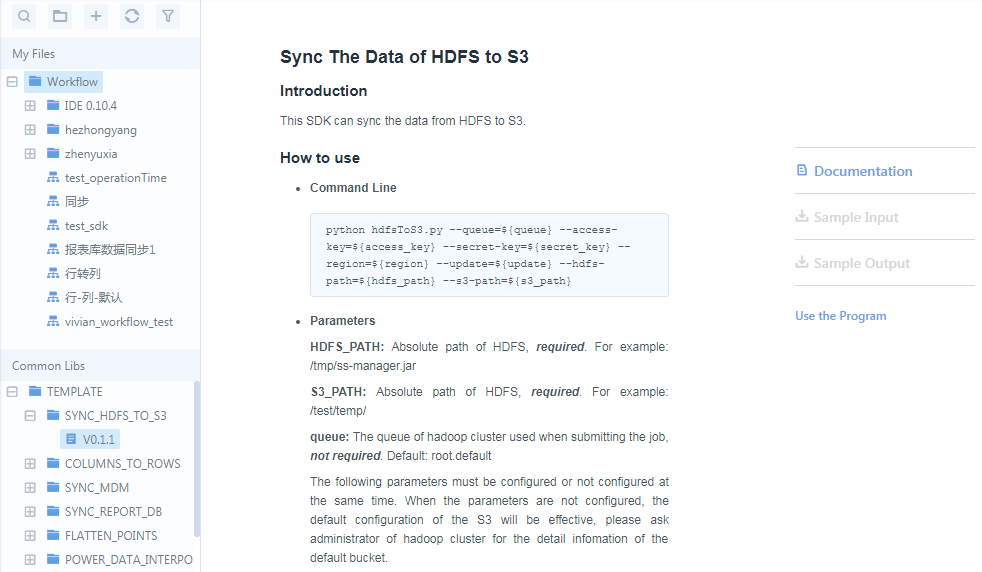
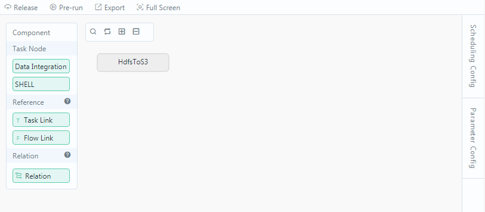

# Common library

EnOS provides various built-in SDKs in its common library to help you access and process data more conveniently. These SDKs lower the development thresholds and improve development efficiency.

## What's provided in the library

<table>
<tbody>
<tr>
<td>SDK name</td>
<td>Description</td>
</tr>
<tr>
<td>SYNC_HDFS_TO_S3</td>
<td>Synchronize data from a specified path in HDFS to a specified path in an S3 database.</td>
</tr>
<tr>
<td>COLUMNS_TO_ROWS</td>
<td>Converts row data of your HIVE table, where each row contains values of all data collecting points of a device at a time, into a table where each row contains historical values of a single data collecting point.</td>
</tr>
<tr>
<td>SYNC_MDM</td>
<td>Synchronizes master data to HDFS.</td>
</tr>
<tr>
<td>SYNC_REPORT_DB</td>
<td>Performs one-time synchronization of full-load of data from Hive table to your target table.</td>
</tr>
<tr>
<td>FLATTEN_POINTS</td>
<td>Converts EnOS raw point data (each row contains historical values of a single data collecting point) to sql-like row data (each row contains values of all data collecting points of a device at a time).</td>
</tr>
<tr>
<td>POWER_DATA_INTERPOLATION</td>
<td>Interpolates power data, especially for the missing data of production.</td>
</tr>
<tr>
<td>SYNC_REPORT_STRUCTURE</td>
<td>Transfers table structure from Hive database, to MySQL report database.</td>
</tr>
<tr>
<td>SHORT_TERM_LOAD_FORECAST</td>
<td>For different power consumers in the grid, provides 0-6 days load forecast for different-level of time granularity (15 min, 30 min, 1 hour, 1 day) based on historical data and optionally weather data.</td>
</tr>
<tr>
<td>HADOOP_FILE_CRUSHER</td>
<td>Combines many small files into fewer larger files.</td>
</tr>
</tbody>
</table>

## How to use the SDK

The major procedure of using the built-in SDK is as follows:

1. In **Data IDE** > **Task Designer**, browse the Common Library tree and locate the SDK that you want to use.
2. Double-click the version of the script and review the details about the script.
  

3. Click **Use the SDK**.

4. In the pop-out window, provide settings about the workflow.
  

5. Provide the scheduling settings. For more information, see [Creating an one-time workflow](creating_workflow_onetime) or [Creating a periodic workflow](creating_workflow_periodic).
