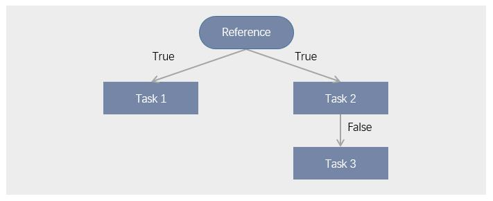

# Data IDE overview

Data developers can use Data IDE to process data through scheduling workflows.

## Key concepts

The following key concepts are involved in the data development process.

**Workflow**  

A workflow is an automatic data processing flow that comprises  _tasks_, _references_, and _relations_.
A workflow can be scheduled to run for one time only or periodically.

**Task**  

A task is the fundamental element of the workflow. A task defines how to process the data. By running a task, the  _resource_ associated with the task is run.

**Reference**  

A reference is a task or workflow that plays as the prerequisite of its succeeding tasks. A reference must be the root of a workflow. For a periodic workflow, the reference takes precedence over the schedule, that is, when the reference is run, the succeeding task is run without waiting for the next cycle of the schedule.

**Relation**  

An upstream task connects to a downstream task through relation. The relation is uni-directional.

**Resource**  

A resource is the script that is run by a task.

## Stages of data development

The data development process falls into the following stages.

- Configuration time  
  At the design time, you create a workflow that comprises tasks to run, and pre-run the workflow to verify whether the workflow works as designed.
- Run time  
  At the run time, workflow runs according to the scheduling parameters.
- Monitor time  
  At the monitor time, you can re-run a single task node or re-run a node and its subsequent nodes to pinpoint issues with the workflow.

The following figure shows an example workflow with reference. In this example, the following facts are true:
1. Task 1 and Task 2 are not run untill the reference is run.
2. If the workflow is periodic, all tasks are run at each cycle as defined by the scheduling parameters.
3. When the reference is triggered while the next cycle is not reached, Task 1 and Task 2 are still run.
4. `True` and `False` applies only at the monitor time when you re-run a task.
   - When `True`, the subsequent task is run.
   - When `Faulse`, the subsequent task is not run.

   

## Major functionalities

The Data IDE toolkit provides the following major functionalities:

**Workflow development**  

According to your business requirements, your can design a workflow that comprises multiple tasks, and each task performs certain actions on your data.

**Resource management**  

You can register your scripts as resources and manage the version of the resources. The resources can then be referenced by tasks in a workflow.
